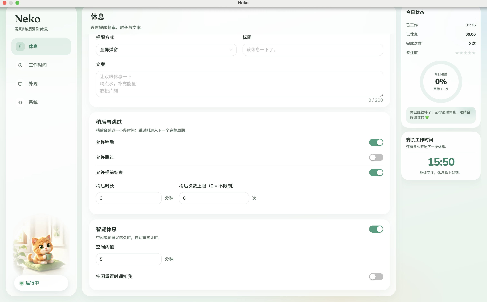
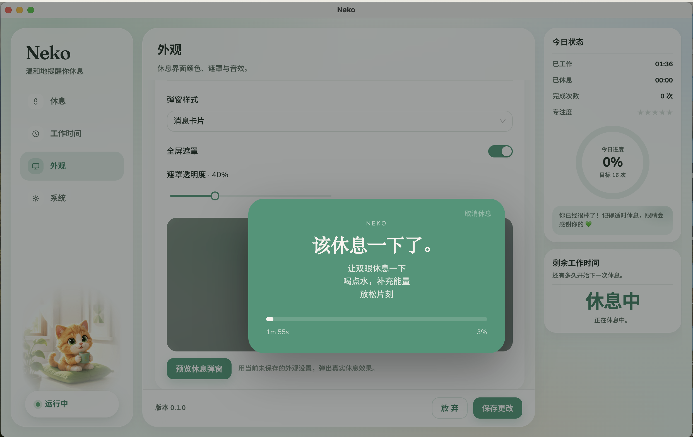

<p align="center">
  
</p>

<h1 align="center">Neko</h1>

<p align="center"><a href="./README.md">中文</a> · <strong>English</strong></p>

<p align="center"><strong>Elegant desktop break reminders</strong> for macOS, Windows, and Linux.</p>

<p align="center">Scheduled breaks, smart resets, and focused reminders. Your settings and data stay on your device.</p>

## Screenshots

### Breaks and today's status

See your break schedule, snooze options, and daily progress at a glance.

<p align="center">
  
</p>

### Appearance and break preview

Tune the appearance and preview the break popup directly in settings.

<p align="center">
  
</p>

## Download and install

[Download Neko from Quark Drive](https://pan.quark.cn/s/223657edd23b), then choose the package for your platform.

| Platform | Installation                                                                    |
| -------- | ------------------------------------------------------------------------------- |
| macOS    | Open the DMG for your processor and drag **Neko** to Applications               |
| Windows  | Run the installer, then launch Neko from the Start menu or desktop shortcut     |
| Linux    | Grant the AppImage execute permission and run it, or install the `.deb` package |

### When macOS cannot open Neko

The current builds are not notarized with an Apple Developer ID. If macOS says the app is damaged, run this in Terminal:

```bash
xattr -cr /Applications/Neko.app
open /Applications/Neko.app
```

If macOS cannot verify the developer, right-click the app and choose **Open**, or use **Open Anyway** in **System Settings → Privacy & Security**. Once started, find Neko in the right side of the menu bar; it does not appear in the Dock.

### Windows and Linux prompts

For an unsigned installer, Windows may show SmartScreen. Choose **More info → Run anyway**. On Linux, use `chmod +x Neko-*.AppImage` before opening an AppImage, or install a deb with `sudo dpkg -i neko_*_amd64.deb`.

## Features

| Feature                         | Description                                                              |
| ------------------------------- | ------------------------------------------------------------------------ |
| **Configurable break schedule** | Set your break frequency, length, and reminder preferences               |
| **Break prompts**               | Message-card popups paired with system notifications                     |
| **Smart resets**                | Adapt the timer based on working hours, idle time, and screen lock state |
| **Menu bar / system tray**      | Check status and open settings from the menu bar or system tray          |
| **Personalization**             | Sounds, appearance, launch at login, and update checks                   |
| **Localized UI**                | Chinese, English, and Japanese, following the system by default          |
| **Local data**                  | Preferences and settings stay on your device                             |

## License

[PolyForm Noncommercial License 1.0.0](https://polyformproject.org/licenses/noncommercial/1.0.0)

Required Notice: Copyright (c) 2026 MultCat Authors

See [`LICENSE`](./LICENSE) in the repository root.
