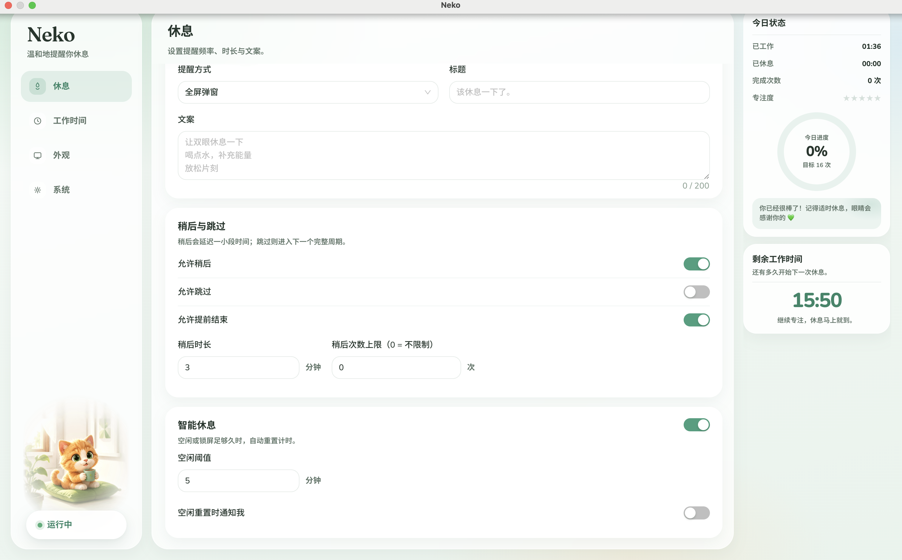
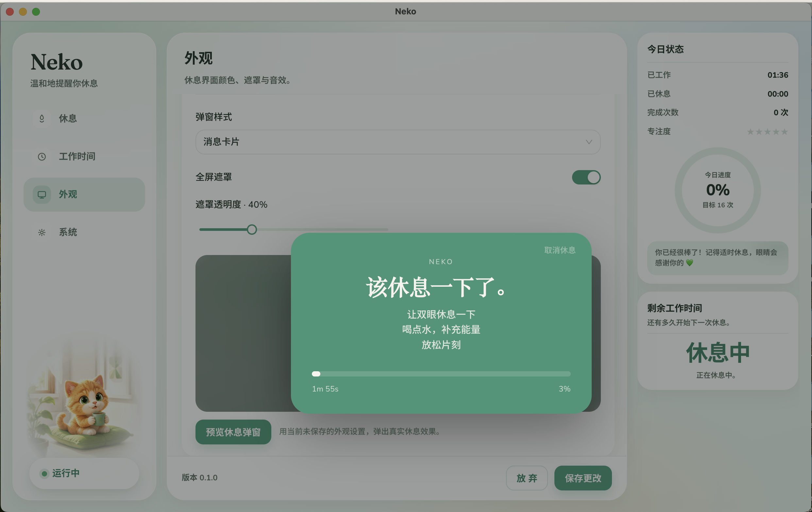

# Neko

<p align="center">
  
</p>

<p align="center">
  <strong>优雅的桌面休息提醒</strong><br />
  macOS · Windows · Linux
</p>

<p align="center">
  <a href="./README.md">English</a> ·
  <a href="https://github.com/rokiai/neko/releases">Releases</a> ·
  <a href="./CHANGELOG.md">Changelog</a>
</p>

优雅的跨平台桌面休息提醒，基于 [electron-vite](https://electron-vite.org/) + React + TypeScript + Ant Design。

仓库：[rokiai/neko](https://github.com/rokiai/neko)

## 截图

<p align="center">
  
</p>

<p align="center">
  <em>休息调度、稍后选项与今日状态</em>
</p>

<p align="center">
  
</p>

<p align="center">
  <em>外观设置，以及休息弹窗实时预览</em>
</p>

## 功能

- 可配置频率 / 时长的休息调度
- 消息卡片 / 视频弹窗、系统通知
- 工作时间、Smart Breaks（空闲 / 锁屏重置）
- 系统托盘（macOS 菜单栏图标；可选菜单栏计时）
- 音效、外观、登录自启、自动更新检查
- 多语言：中文 / English / 日本語（默认跟随系统）

## 安装教程（推荐）

从 GitHub Releases 下载对应系统的安装包，无需自己编译。

1. 打开 [Releases](https://github.com/rokiai/neko/releases)
2. 在最新版本的 **Assets** 里按系统选择文件：

| 系统        | 下载文件                                                                | 安装方式                                                |
| ----------- | ----------------------------------------------------------------------- | ------------------------------------------------------- |
| **macOS**   | `Neko-x.y.z-arm64.dmg`（Apple Silicon）或 `Neko-x.y.z-x64.dmg`（Intel） | 打开 DMG，将 Neko 拖到「应用程序」                      |
| **Windows** | `Neko-x.y.z-setup.exe`                                                  | 双击安装向导，按提示完成                                |
| **Linux**   | `Neko-x.y.z.AppImage` 或 `.deb`                                         | AppImage：赋予执行权限后运行；deb：`sudo dpkg -i *.deb` |

3. **macOS 提示「无法验证开发者」时**  
   系统设置 → 隐私与安全性 → 仍要打开；或在终端执行：

   ```bash
   xattr -cr /Applications/Neko.app
   ```

4. 启动后，菜单栏 / 托盘会出现 Neko；关闭设置窗口不会退出，点托盘图标可再打开。彻底退出请用托盘菜单里的「退出」。

## 用 GitHub Actions 打包三个系统

仓库已配置 [`.github/workflows/release.yml`](.github/workflows/release.yml)，会在 **macOS / Windows / Linux** 上分别打出安装包（桌面端，不是 Android）。

**方式 A：打 tag 发版（正式）**

```bash
git tag v0.1.0
git push origin v0.1.0
```

推送 `v*` tag 后自动构建，并创建 **draft** GitHub Release（需在网页上确认发布）。

**方式 B：手动跑一次（可只构建不发布）**

1. GitHub 仓库 → **Actions** → **Release**
2. **Run workflow**
3. `dry_run=true`：只构建并上传 Artifacts  
   `dry_run=false` 且当前是 tag：会创建 Release

产物示例：`.dmg` / `.zip`（mac）、`-setup.exe`（win）、`.AppImage` / `.deb`（linux），以及供自动更新用的 `latest*.yml`。

## 本地开发

```bash
pnpm install
pnpm dev          # 必须用 Electron 窗口，不要只开浏览器
```

```bash
pnpm lint && pnpm typecheck && pnpm test
pnpm build:mac    # 或 build:win / build:linux
```

## 自动更新

已接入 `electron-updater`（GitHub Releases）：

- **仅打包后的正式安装包**会检查更新（`pnpm dev` 不会）
- 发现新版本后会发系统通知；部分平台会后台下载，退出时安装
- 需 Release 中包含 electron-builder 生成的 `latest.yml` / `latest-mac.yml` 等（Actions 已上传）

macOS 未公证时，自动更新体验可能受限，可手动从 Releases 下载覆盖安装。

## 结构

```
src/
  main/       # 调度、托盘、窗口、持久化
  preload/    # 类型化 IPC
  renderer/   # 设置 / 休息 / 音效页
  shared/     # 共享类型、i18n、纯逻辑
```

## 许可

[PolyForm Noncommercial License 1.0.0](https://polyformproject.org/licenses/noncommercial/1.0.0)

Required Notice: Copyright (c) 2026 MultCat Authors

详见仓库根目录 [`LICENSE`](./LICENSE)。
